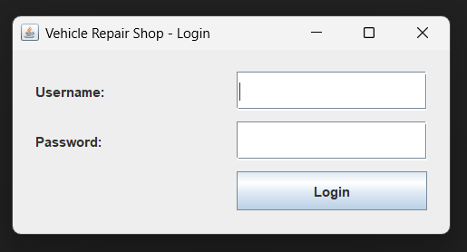
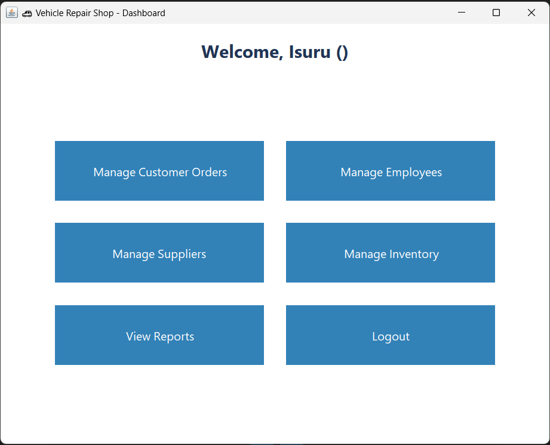
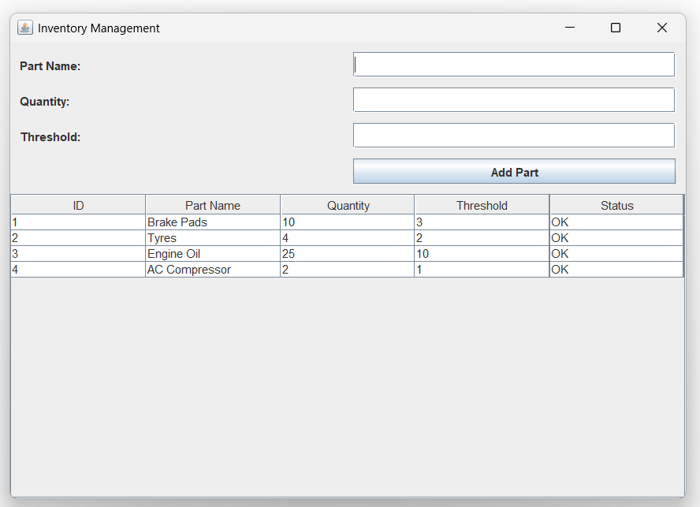
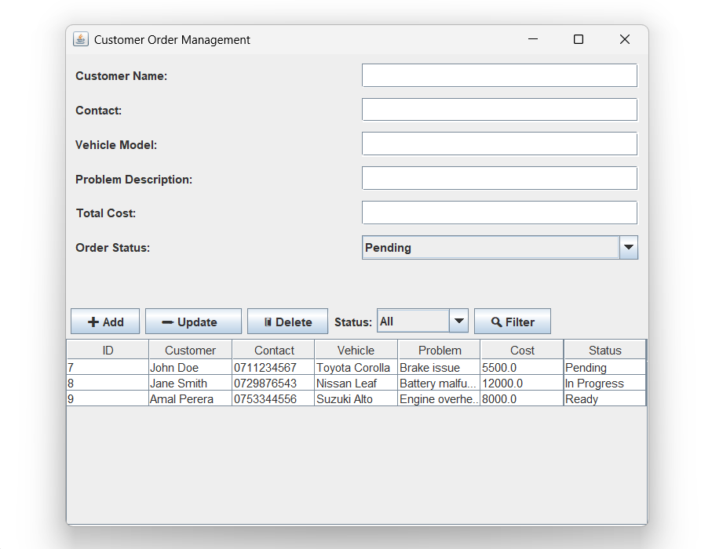
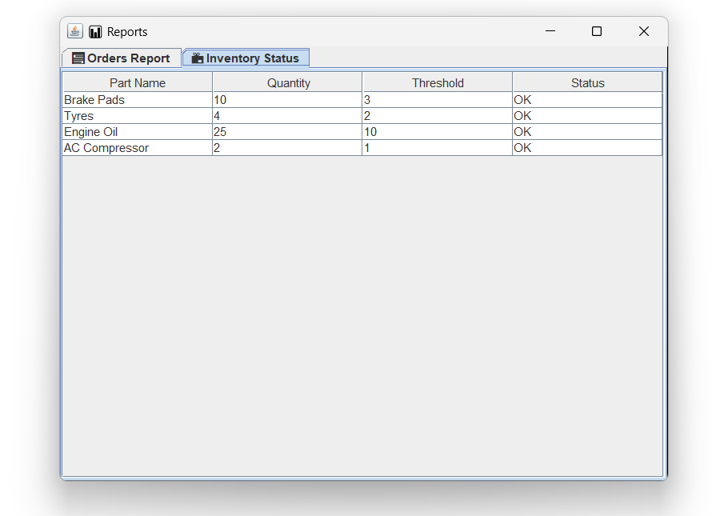

# 🚗 Vehicle Repair Shop Management System

A complete Java Swing desktop application for managing a vehicle repair shop.

## ✨ Features

- ✅ Secure Login System (Admin / Staff)
- 🧾 Customer Order Management (Add, Update, Delete, View)
- 🏷️ Supplier Management
- 👨‍🔧 Employee Management
- 📦 Inventory Tracking (with Low Stock Warning)
- 📊 Reports Module (Daily/Monthly)
- 🔍 Search & Filter support

## 🛠 Tech Stack

- Java (Swing GUI)
- MySQL (JDBC)
- MVC Architecture
- Prepared Statements (SQL Injection Safe)
- Clean OOP Design

## 📁 Project Structure

```
/src
  ├── db/             # DBConnection class
  ├── model/          # Model classes (User, Order, Supplier...)
  ├── view/           # GUI forms (LoginForm, Dashboard...)
  ├── controller/     # Logic classes (UserController...)
Main.java             # Entry point
```

## 🧪 Login Credentials

| Username | Password  | Role  |
|----------|-----------|-------|
| admin    | admin123  | Admin |
| staff1   | staff123  | Staff |


## 🗂️ Project Structure Screenshot

### 🧪 Login View


---

### 🧪 Dashboard View


---

### 🧪 Employee Management


---

### 🧪 Inventory Management


---

### 🧪 Customer Order Management


---

### 🧪 Reports



## 🧰 Setup Instructions

### 1. Import SQL Database

- Open **XAMPP** and start MySQL
- Open **phpMyAdmin**
- Create a new database called `vehicle_repair`
- Import the file: `vehicle_repair_schema.sql`

### 2. Run the App

- Open the project in IntelliJ IDEA
- Run `Main.java`
- Login with given credentials

### 3. Project Ready 🎉

- Explore all modules from the Dashboard
- You can add/modify code easily as it follows clean MVC

---

## 🧑‍💻 Developed For Learning & Real Use

Ideal for academic projects, learning enterprise Java, and even light real-world deployment.

---

## 📌 Notes

- If database connection fails, check your MySQL user/pass in `DBConnection.java`
- Java version: JDK 17+ recommended (you’re using JDK 23 — that’s fine too)

---

Happy Building 🚀
